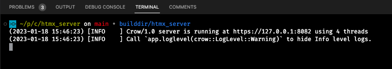
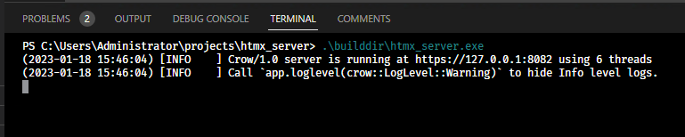

### Web server based on CrowCpp and htmx

This web server uses [CrowCpp](https://github.com/CrowCpp/Crow) as its backend and [htmx](https://htmx.org) on the frontend.

C++ in the backend provides fast, native binaries, while htmx on the frontend provides responsive web apps that don't need JS-frameworks.

This reduces code bloat on both sides.

**Notice**: *This project is still in development. There is not much to see in the browser.*

### Compilation

* Windows

Windows users will have to setup [MSYS](https://www.msys2.org/) environment first. After the installation, select the `MSYS2 MINGW64` entry in the Windows Start Menu. **Do not use the `MSYS UCRT4` or any other entry!**

#### Build system

In the newly opened bash window, enter this command to install the required packages:

`pacman -S git mingw-w64-x86_64-gcc mingw-w64-x86_64-cmake make mingw-w64-x86_64-c-ares mingw-w64-x86_64-jsoncpp mingw-w64-x86_64-openssl`

Check if the compiler is available with `which g++`. You should see a message like this:

```shell
$ which g++
/mingw64/bin/g++
```

You will also need an editor to update the environment paths, so install your preferred one, e.g. `pacman -Sy nano` or `pacman -Sy vim`

Open your `.bash_profile` with `nano .$HOME/.bash_profile` and add these three lines to the end of the file:


```bash
PATH=/mingw64/bin:$PATH
export VCPKG_DEFAULT_TRIPLET=x64-mingw-static
export VCPKG_DEFAULT_HOST_TRIPLET=x64-mingw-static
```

Save & close the file. Reload it with: `source $HOME/.bash_profile` or `. ~/.bash_profile`

The two triplet entries will be needed later to instruct `vcpkg` to use MinGW instead of the default Visual C++ compiler. And as we also want to compile static libraries only, we announce it by using the `static` suffix.

* macOS / Linux

Install `brew` package manager and then use it to install Meson with `brew install meson`.

#### Installing CrowCpp

The easiest way to install it is by using [vcpkg](https://vcpkg.io/en/index.html): 
  * Windows: `vcpkg install crow:x64-mingw-static`
  * macOS/Linux: `vcpkg install crow`
### Meson

My build system of choice is [Meson](https://mesonbuild.com/), because `Makefiles` are hard to maintain and I simply don't want to learn how to use `CMake`. Life is too short for user-hostile software.

There are two scripts, `buildall.sh` (macOS/Linux) and `buildall.ps1` (Windows). With these two the following steps will be executed:

* Copy web files (index.html, styles etc.) to `builddir` (*only on Windows, in macOS/Linux this will be done by Meson*)
* Initialize and run Meson:
   * compile sources from `src`
   * put the output binary into `builddir`

Before trying to build the project, please, adapt these two variables in the `meson.build` file:

* [triplet](meson.build#L22)
* [vcpkg_root](meson.build#L27)

The `triplet` carries the information about the host machine, e.g. `x64-osx`.

The `vcpkg_root` is the root folder containing packages installed by `vcpkg`.

### Compilation

* Windows: in PowerShell with `./buildall.ps1`
* macOS/Linux: `./buildall.sh`

### Usage

After a successful compilation, run the htmx_server executable from `builddir`. 

Open the page on https://127.0.0.1:8082

This demo uses SSL by default and the self-signed certificates are included.




## LICENSE

[MIT](LICENSE)